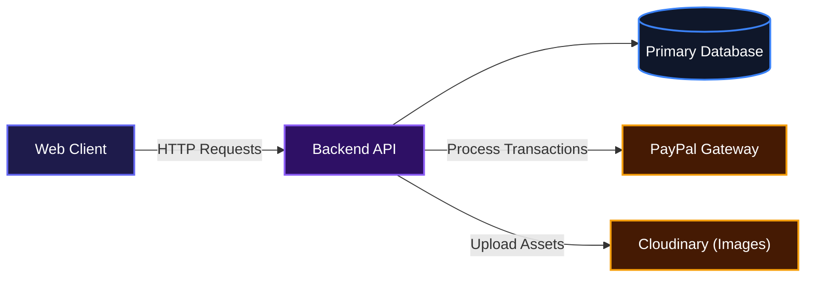
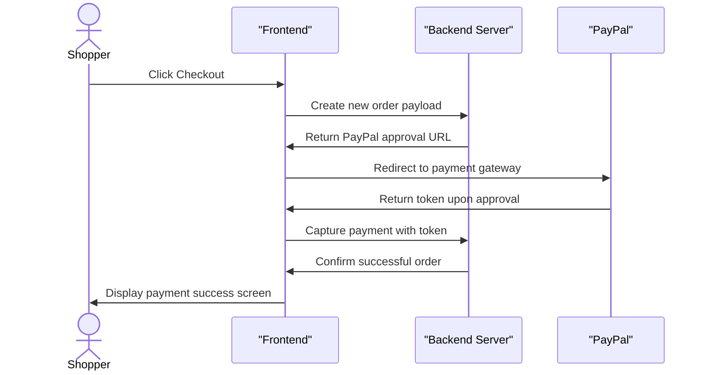

# E-Commerce Platform

This project provides teams with a complete, ready-to-use storefront and admin dashboard for online retail. It gives developers a fully configured shopping cart, user authentication system, and checkout pipeline so they can focus on selling products instead of building complex e-commerce logic from scratch. Users get a clean shopping interface, while administrators get a dedicated panel to manage inventory and track orders.

## System Architecture



## Features

* **Role-Based Authentication**
  The application automatically routes users based on their roles. Standard shoppers are directed to the storefront, while administrators are redirected to the management dashboard. Route protection is handled seamlessly across all pages.

* **Complete Checkout and Payment Pipeline**
  Shoppers can manage multiple shipping addresses, review their cart, and securely pay using PayPal. The system tracks the payment state and captures the transaction before finalizing the order.



* **Admin Inventory Management**
  Administrators can add, edit, and delete products directly from the dashboard. The form includes drag-and-drop image uploading that connects to Cloudinary, ensuring product images are optimized and stored externally.

* **Order Tracking and Fulfillment**
  Shoppers can view their order history and track fulfillment statuses. Administrators have a dedicated view to see all incoming orders and update their status from pending to delivered or rejected.

* **Product Reviews and Ratings**
  Authenticated users can leave text reviews and star ratings on products they have purchased. The system automatically calculates and displays the average rating for each item in the catalog.

## Installation

Follow these instructions to run the application locally.

Clone the repository:
```bash
git clone https://github.com/EbubeStrong/shopping_application.git
```

Navigate to the project directory:
```bash
cd shopping_application
```

Install dependencies:
```bash
npm install
```

Create a `.env` file in the root directory and add the backend API URL:
```env
VITE_API_URL=http://localhost:5000
```

Start the development server:
```bash
npm run dev
```

## Usage

Once the application is running, you can access the frontend in your browser. The default Vite port is typically `http://localhost:5000` as configured in `vite.config.js`.

To explore the platform, you will need to register a new account. By default, newly registered accounts are given standard user permissions. 

To access the admin panel, you must log in with an account that has its role set to `admin` in your backend database. Once logged in as an admin, navigate to the dashboard to begin uploading product images and populating the catalog.

The shopping interface includes a robust filtering system. You can sort products by price and filter them by category or brand. The application updates the URL search parameters automatically, allowing you to share links to specific filtered views.

## Expected API Documentation

This frontend application expects a backend service to handle data persistence and business logic. Below are the key API endpoints the React client consumes.

### Auth Endpoints

#### POST /api/auth/login
**Description**: Authenticates a user and returns a session token.

**Request**:
```json
{
  "email": "user@example.com",
  "password": "securepassword123"
}
```

**Response**:
```json
{
  "success": true,
  "token": "eyJhbGciOiJIUzI1NiIsIn...",
  "user": {
    "id": "123",
    "userName": "johndoe",
    "email": "user@example.com",
    "role": "user"
  }
}
```

**Errors**:
* 400: Invalid credentials or missing fields.
* 404: User not found.

#### GET /api/auth/check-auth
**Description**: Validates the current authentication token.

**Request**:
Requires an `Authorization: Bearer <token>` header.

**Response**:
```json
{
  "success": true,
  "user": {
    "id": "123",
    "userName": "johndoe",
    "role": "user"
  }
}
```

**Errors**:
* 401: Unauthorized or expired token.

### Product Endpoints

#### GET /api/shop/products/get
**Description**: Retrieves the product catalog. Accepts query parameters for sorting and filtering.

**Request**:
`GET /api/shop/products/get?category=men,women&sortBy=price-low-to-high`

**Response**:
```json
{
  "success": true,
  "data": [
    {
      "_id": "abc123def",
      "title": "Running Shoes",
      "description": "Comfortable running shoes",
      "price": 99.99,
      "salePrice": 79.99,
      "category": "footwear",
      "brand": "nike",
      "image": "https://cloudinary.com/...",
      "totalStock": 50
    }
  ]
}
```

#### POST /api/admin/products/add
**Description**: Adds a new product to the catalog. Requires admin privileges.

**Request**:
```json
{
  "title": "Classic T-Shirt",
  "description": "100% cotton t-shirt",
  "price": 25,
  "salePrice": 0,
  "category": "men",
  "brand": "levis",
  "totalStock": 100,
  "image": "https://cloudinary.com/..."
}
```

**Response**:
```json
{
  "success": true,
  "data": {
    "_id": "xyz789",
    "title": "Classic T-Shirt"
  }
}
```

**Errors**:
* 401: Unauthorized.
* 403: Forbidden (not an admin).

### Order Endpoints

#### POST /api/shop/order/create
**Description**: Initializes a new order and returns a PayPal approval URL.

**Request**:
```json
{
  "userId": "123",
  "cartId": "cart456",
  "cartItems": [
    {
      "productId": "abc123def",
      "title": "Running Shoes",
      "price": 79.99,
      "quantity": 1
    }
  ],
  "addressInfo": {
    "addressId": "addr789",
    "address": "123 Main St",
    "city": "New York",
    "pincode": "10001",
    "phone": "555-0100"
  },
  "totalAmount": 79.99
}
```

**Response**:
```json
{
  "success": true,
  "orderId": "order999",
  "approvalURL": "https://www.paypal.com/checkoutnow?token=EC-123456789"
}
```

#### POST /api/shop/order/capture
**Description**: Captures the payment after successful PayPal authorization.

**Request**:
```json
{
  "paypalOrderId": "EC-123456789",
  "payerId": "PAYER98765",
  "orderId": "order999"
}
```

**Response**:
```json
{
  "success": true,
  "message": "Payment successful and order confirmed"
}
```

## Technologies Used

| Technology | Purpose |
| :--- | :--- |
| React | Frontend UI Library |
| React Router v7 | Application Routing |
| Redux Toolkit | Global State Management |
| Tailwind CSS | Utility-first Styling |
| Radix UI | Accessible Component Primitives |
| Framer Motion | Interface Animations |
| Vite | Frontend Build Tool |
| Axios | HTTP Client |


## Author

* LinkedIn: [https://linkedin.com/in/AbrahamSamuel567](https://linkedin.com/in/AbrahamSamuel567)
* X (Twitter): [https://x.com/ebubestrong21](https://x.com/ebubestrong21)

##

[](https://reactjs.org/)
[](https://redux.js.org/)
[](https://tailwindcss.com/)
[](https://vitejs.dev/)

[](https://dokugen.samueltuoyo.com)