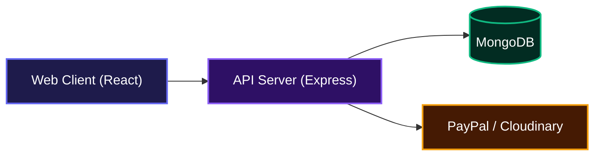
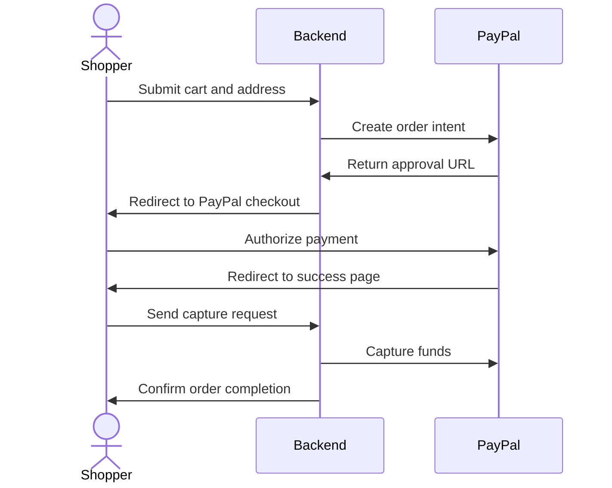

# E-Commerce Platform

This project helps teams launch a complete digital storefront with minimal friction. It processes secure payments, manages user shopping carts, and gives administrators full control over product inventory and order fulfillment. The platform handles everything from product discovery to final checkout, producing exactly what developers and businesses need to sell online without complicated setups.

## System Architecture



## Features

*   **Secure Authentication**: Role-based access control separates normal shoppers from store administrators to ensure data remains secure.
*   **Payment Processing**: Integrated checkout flow that securely processes user payments through PayPal and confirms orders instantly.



*   **Product Management**: Administrators can upload product images directly to Cloudinary, adjust prices, and manage real-time stock levels.
*   **Cart and Order History**: Users can build their cart, save multiple shipping addresses for future use, and track ongoing order statuses.

## Installation

Clone the repository to your local machine:

```bash
git clone https://github.com/EbubeStrong/shopping_application.git
```

Install the dependencies for both the client and the server.

Navigate to the client directory and install dependencies:

```bash
cd Client
npm install
```

Navigate to the server directory and install dependencies:

```bash
cd ../Server
npm install
```

Set up the required environment variables. Create a `.env` file inside the `Server` directory with the following keys:

```env
PORT=5000
MONGODB_URL=your_mongodb_connection_string
CLIENT_BASE_URL=http://localhost:5000
PAYPAL_CLIENT_ID=your_paypal_client_id
PAYPAL_CLIENT_SECRET=your_paypal_secret
CLOUDINARY_CLOUD_NAME=your_cloudinary_cloud_name
CLOUDINARY_API_KEY=your_cloudinary_api_key
CLOUDINARY_API_SECRET=your_cloudinary_api_secret
```

## Usage

To run the application locally, you need to start both the client and server development servers.

Start the backend API server:

```bash
cd Server
npm run start
```

Start the frontend React client:

```bash
cd Client
npm run dev
```

The client will be available in your browser at `http://localhost:5000`, and it will communicate with the backend running on the port specified in your environment variables.

## Technologies Used

| Category | Technologies |
| --- | --- |
| Frontend | React, Redux Toolkit, Tailwind CSS, Shadcn UI, Vite |
| Backend | Node.js, Express, JSON Web Tokens (JWT) |
| Database | MongoDB, Mongoose |
| External Services | PayPal Checkout SDK, Cloudinary |

## API Documentation

The backend provides a comprehensive REST API for authentication, administrative controls, and shopping functionalities. All authenticated endpoints require a valid JWT token sent via an HTTP-only cookie.

### Authentication Endpoints

#### POST /api/auth/register
**Description**: Registers a new user account and returns a session token.

**Request**:
```json
{
  "userName": "johndoe",
  "email": "john@example.com",
  "password": "securepassword"
}
```

**Response**:
```json
{
  "success": true,
  "message": "Registration Successful",
  "user": {
    "id": "user_id_string",
    "userName": "johndoe",
    "email": "john@example.com"
  },
  "token": "jwt_token_string"
}
```

**Errors**:
*   400: User already exists. Please log in.
*   500: Some error occurred.

#### POST /api/auth/login
**Description**: Authenticates a user and establishes a session.

**Request**:
```json
{
  "email": "john@example.com",
  "password": "securepassword"
}
```

**Response**:
```json
{
  "success": true,
  "message": "Logged in successfully",
  "token": "jwt_token_string",
  "user": {
    "email": "john@example.com",
    "role": "user",
    "id": "user_id_string",
    "userName": "johndoe"
  }
}
```

**Errors**:
*   200: User not found or incorrect password (handled with success: false in this project).
*   500: An error occurred while logging in.

#### POST /api/auth/logout
**Description**: Clears the authentication token cookie to log the user out.

**Response**:
```json
{
  "success": true,
  "message": "Logged out successfully"
}
```

#### GET /api/auth/check-auth
**Description**: Verifies if the current user session is valid.

**Response**:
```json
{
  "success": true,
  "message": "Authenticated user!",
  "user": {
    "id": "user_id_string",
    "email": "john@example.com",
    "role": "user"
  }
}
```

**Errors**:
*   401: Unauthorized user.

### Admin Product Endpoints

#### POST /api/admin/products/upload-image
**Description**: Uploads a product image to Cloudinary. Requires multipart/form-data.

**Response**:
```json
{
  "success": true,
  "message": "Image uploaded successfully",
  "result": {
    "secure_url": "https://cloudinary.com/image.jpg"
  }
}
```

#### POST /api/admin/products/add
**Description**: Creates a new product in the store catalog.

**Request**:
```json
{
  "image": "https://cloudinary.com/image.jpg",
  "title": "Running Shoes",
  "description": "Comfortable running shoes",
  "category": "footwear",
  "brand": "Nike",
  "price": 100,
  "salePrice": 80,
  "totalStock": 50
}
```

**Response**:
```json
{
  "success": true,
  "data": {
    "_id": "product_id"
  }
}
```

#### PUT /api/admin/products/edit/:id
**Description**: Updates an existing product's details.

**Request**:
```json
{
  "price": 90,
  "totalStock": 45
}
```

**Response**:
```json
{
  "success": true,
  "data": {
    "_id": "product_id",
    "price": 90
  }
}
```

**Errors**:
*   404: Product not found.

#### DELETE /api/admin/products/delete/:id
**Description**: Removes a product from the catalog.

**Response**:
```json
{
  "success": true,
  "message": "Product deleted successfully"
}
```

#### GET /api/admin/products/get
**Description**: Retrieves the complete list of all products.

**Response**:
```json
{
  "success": true,
  "data": []
}
```

### Admin Order Endpoints

#### GET /api/admin/orders/get
**Description**: Retrieves all orders placed by all users.

**Response**:
```json
{
  "success": true,
  "data": []
}
```

#### GET /api/admin/orders/details/:id
**Description**: Retrieves detailed information about a specific order for administrative purposes.

**Response**:
```json
{
  "success": true,
  "data": {
    "_id": "order_id"
  }
}
```

#### PUT /api/admin/orders/update-status/:id
**Description**: Updates the fulfillment status of an order.

**Request**:
```json
{
  "orderStatus": "inShipping"
}
```

**Response**:
```json
{
  "success": true,
  "message": "Order status is updated successfully!",
  "data": {}
}
```

### Shopping Endpoints

#### GET /api/shop/products/get
**Description**: Fetches products available for shoppers, supporting category and brand filtering via query parameters.

**Response**:
```json
{
  "success": true,
  "data": []
}
```

#### GET /api/shop/products/get/:id
**Description**: Retrieves details for a specific product for the shopping view.

**Response**:
```json
{
  "success": true,
  "data": {}
}
```

#### POST /api/shop/cart/add
**Description**: Adds a specific quantity of a product to the user's cart.

**Request**:
```json
{
  "userId": "user_id_string",
  "productId": "product_id_string",
  "quantity": 2
}
```

**Response**:
```json
{
  "success": true,
  "message": "Product added to cart successfully",
  "data": {}
}
```

#### GET /api/shop/cart/get/:userId
**Description**: Retrieves all items currently in the user's shopping cart.

**Response**:
```json
{
  "success": true,
  "message": "Cart fetched successfully",
  "data": {
    "items": []
  }
}
```

#### PUT /api/shop/cart/update-cart
**Description**: Updates the quantity of a specific item in the cart.

**Request**:
```json
{
  "userId": "user_id_string",
  "productId": "product_id_string",
  "quantity": 3
}
```

**Response**:
```json
{
  "success": true,
  "message": "Cart updated successfully",
  "data": {}
}
```

#### DELETE /api/shop/cart/:userId/:productId
**Description**: Removes a specific product completely from the user's cart.

**Response**:
```json
{
  "success": true,
  "message": "Cart updated successfully",
  "data": {}
}
```

#### POST /api/shop/address/add
**Description**: Saves a new shipping address to the user's profile.

**Request**:
```json
{
  "userId": "user_id_string",
  "address": "123 Main St",
  "city": "Metropolis",
  "pincode": "12345",
  "phone": "555-0100",
  "notes": "Leave at front door"
}
```

**Response**:
```json
{
  "success": true,
  "data": {}
}
```

#### GET /api/shop/address/get/:userId
**Description**: Retrieves all saved addresses for a specific user.

**Response**:
```json
{
  "success": true,
  "data": []
}
```

#### PUT /api/shop/address/update/:userId/:addressId
**Description**: Updates an existing saved address.

**Request**:
```json
{
  "city": "New Metropolis"
}
```

**Response**:
```json
{
  "success": true,
  "data": {}
}
```

#### DELETE /api/shop/address/delete/:userId/:addressId
**Description**: Deletes a saved address from the user's profile.

**Response**:
```json
{
  "success": true,
  "message": "Address deleted Successfully"
}
```

#### POST /api/shop/order/create
**Description**: Initiates a new order and generates a PayPal payment intent.

**Request**:
```json
{
  "userId": "user_id_string",
  "cartItems": [],
  "addressInfo": {},
  "orderStatus": "pending",
  "paymentStatus": "pending",
  "paymentMethod": "paypal",
  "totalAmount": 150.00,
  "cartId": "cart_id_string"
}
```

**Response**:
```json
{
  "success": true,
  "approvalURL": "https://paypal.com/checkout/url",
  "orderId": "new_order_id"
}
```

#### POST /api/shop/order/capture
**Description**: Captures the authorized PayPal payment and confirms the order.

**Request**:
```json
{
  "paypalOrderId": "paypal_token",
  "payerId": "paypal_payer_id",
  "orderId": "database_order_id"
}
```

**Response**:
```json
{
  "success": true,
  "message": "Order Confirmed",
  "data": {}
}
```

#### GET /api/shop/order/list/:userId
**Description**: Retrieves the full order history for a specific shopper.

**Response**:
```json
{
  "success": true,
  "data": []
}
```

#### GET /api/shop/order/details/:id
**Description**: Retrieves specific details for an order from the shopping view.

**Response**:
```json
{
  "success": true,
  "data": {}
}
```

#### GET /api/shop/search/:keyword
**Description**: Searches the product catalog by title, description, category, or brand.

**Response**:
```json
{
  "success": true,
  "data": []
}
```

#### POST /api/shop/review/add
**Description**: Submits a user review for a purchased product.

**Request**:
```json
{
  "productId": "product_id_string",
  "userId": "user_id_string",
  "userName": "johndoe",
  "reviewMessage": "Great product!",
  "reviewValue": 5
}
```

**Response**:
```json
{
  "success": true,
  "data": {}
}
```

#### GET /api/shop/review/:productId
**Description**: Retrieves all reviews associated with a specific product.

**Response**:
```json
{
  "success": true,
  "data": []
}
```

### Common Feature Endpoints

#### POST /api/common/feature/add
**Description**: Uploads a promotional feature image for the homepage carousel.

**Request**:
```json
{
  "image": "https://cloudinary.com/banner.jpg"
}
```

**Response**:
```json
{
  "success": true,
  "data": {}
}
```

#### GET /api/common/feature/get
**Description**: Retrieves all uploaded promotional feature images.

**Response**:
```json
{
  "success": true,
  "data": []
}
```

#### DELETE /api/common/feature/delete/:id
**Description**: Deletes a promotional feature image.

**Response**:
```json
{
  "success": true,
  "message": "Feature image deleted successfully"
}
```

## Author Info

*   LinkedIn: https://linkedin.com/in/AbrahamSamuel567
*   X: https://x.com/ebubestrong21

## Badges

[](https://nodejs.org/)
[](https://expressjs.com/)
[](https://reactjs.org/)
[](https://www.mongodb.com/)
[](https://tailwindcss.com/)