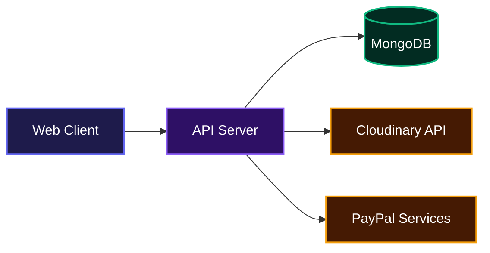
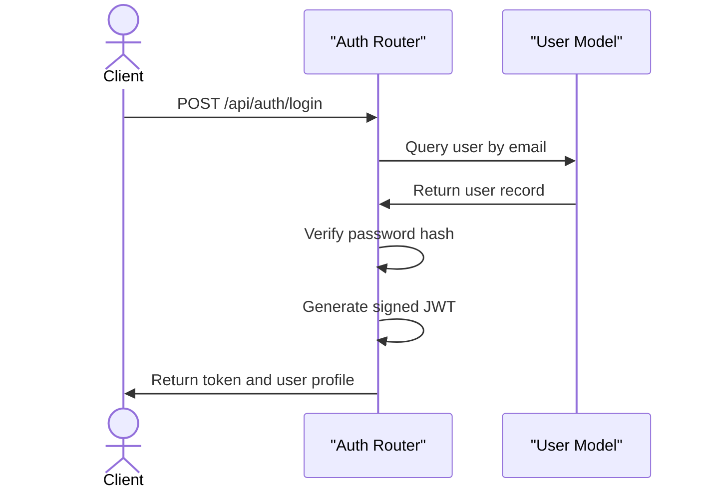
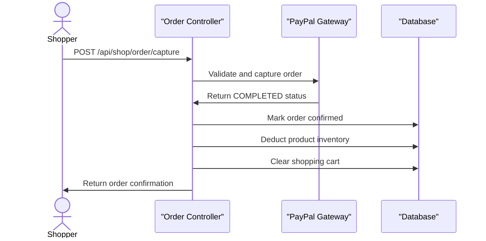

# E-Commerce Backend Server

This project helps developers build and scale online storefronts by providing a complete foundational backend. It manages the entire checkout lifecycle, from shopping cart state to secure transaction capture, providing teams with a reliable data layer. No complicated setup, just straightforward API endpoints that power digital commerce and handle everything from product catalogs to user authentication.

## System Architecture



## Features

### Secure Authentication and Authorization
The server provides role-based access control out of the box. It handles password hashing securely using bcrypt and issues JWTs for stateless session management.



### End-to-End Payment Processing
A built-in integration with the PayPal Checkout API enables frictionless payments. The server orchestrates the order creation, verifies the transaction status, deducts inventory stock, and safely clears the user cart upon a successful capture.



### Dynamic Cart and Order Management
The backend models a complete retail workflow. Users can maintain persistent shopping carts, apply specific delivery addresses, and track historical orders, while administrators have dedicated routes to update fulfillment statuses.

### Product Catalog and Search
A robust product schema allows teams to define items by category, brand, and pricing logic. The server supports regular expression-based keyword searching and multi-parameter filtering to power responsive frontend store interfaces.

## Installation

Follow these instructions to get the backend running locally.

Clone the Repository:

```bash
git clone https://github.com/EbubeStrong/shopping_application.git
```

Navigate into the directory and install dependencies:

```bash
cd shopping_application
npm install
```

Create a `.env` file in the root directory and configure the required environment variables:

```env
PORT=5000
MONGODB_URL=your_mongodb_connection_string
CLIENT_BASE_URL=http://localhost:5173
CLOUDINARY_CLOUD_NAME=your_cloudinary_name
CLOUDINARY_API_KEY=your_cloudinary_api_key
CLOUDINARY_API_SECRET=your_cloudinary_api_secret
PAYPAL_CLIENT_ID=your_paypal_client_id
PAYPAL_CLIENT_SECRET=your_paypal_client_secret
```

Start the development server:

```bash
npm start
```

## Usage

Once the server is running, it will automatically connect to your MongoDB cluster and bind to the specified port. You can verify the server is live by making a simple GET request to the root URL.

To test the application health, you can run this command in your terminal:

```bash
curl http://localhost:5000/
```

This will return a confirmation string indicating the e-commerce server is live and accepting API connections. From there, you can connect your frontend application to the exposed API routes.

## API Documentation

Below is the complete reference for all available endpoints exposed by the server. 

### Authentication

#### POST /api/auth/register
**Description**: Registers a new customer account.

**Request**:
```json
{
  "userName": "johndoe",
  "email": "john@example.com",
  "password": "securepassword123"
}
```

**Response**:
```json
{
  "success": true,
  "message": "Registration Successful",
  "user": {
    "id": "60d5ecb8b392d7...",
    "userName": "johndoe",
    "email": "john@example.com"
  },
  "token": "eyJhbGciOiJIUzI1..."
}
```

**Errors**:
- 400: User already exists. Please log in.
- 500: Some error occurred.

#### POST /api/auth/login
**Description**: Authenticates a user and issues a session token.

**Request**:
```json
{
  "email": "john@example.com",
  "password": "securepassword123"
}
```

**Response**:
```json
{
  "success": true,
  "message": "Logged in successfully",
  "token": "eyJhbGciOiJIUzI1...",
  "user": {
    "email": "john@example.com",
    "role": "user",
    "id": "60d5ecb8b392d7...",
    "userName": "johndoe"
  }
}
```

**Errors**:
- 200 (Success False): User not found or incorrect password.
- 500: An error occurred while logging in.

#### POST /api/auth/logout
**Description**: Clears the authentication token cookie.

**Request**: None.

**Response**:
```json
{
  "success": true,
  "message": "Logged out successfully"
}
```

#### GET /api/auth/check-auth
**Description**: Validates the current JWT token. Requires Bearer token authorization header.

**Request**: None.

**Response**:
```json
{
  "success": true,
  "message": "Authenticated user!",
  "user": {
    "id": "60d5ecb8b392d7...",
    "email": "john@example.com",
    "role": "user"
  }
}
```

### Admin Products

#### POST /api/admin/products/upload-image
**Description**: Uploads a product image directly to Cloudinary via a multipart/form-data request.

**Request**: form-data containing a `my_file` field with the image buffer.

**Response**:
```json
{
  "success": true,
  "message": "Image uploaded successfully",
  "result": {
    "url": "https://res.cloudinary.com/..."
  }
}
```

#### POST /api/admin/products/add
**Description**: Adds a new item to the product catalog.

**Request**:
```json
{
  "image": "https://res.cloudinary.com/...",
  "title": "Premium Sneakers",
  "description": "High quality running shoes",
  "category": "shoes",
  "brand": "Nike",
  "price": 120,
  "salePrice": 99,
  "totalStock": 50
}
```

**Response**:
```json
{
  "success": true,
  "data": {
    "_id": "...",
    "title": "Premium Sneakers"
  }
}
```

#### PUT /api/admin/products/edit/:id
**Description**: Updates fields on an existing product.

**Request**:
```json
{
  "price": 110,
  "totalStock": 40
}
```

**Response**:
```json
{
  "success": true,
  "data": {
    "_id": "...",
    "price": 110
  }
}
```

#### DELETE /api/admin/products/delete/:id
**Description**: Removes a product from the database entirely.

**Request**: None.

**Response**:
```json
{
  "success": true,
  "message": "Product deleted successfully"
}
```

#### GET /api/admin/products/get
**Description**: Fetches the complete catalog of all stored products.

**Request**: None.

**Response**:
```json
{
  "success": true,
  "data": [
    {
      "title": "Premium Sneakers"
    }
  ]
}
```

### Admin Orders

#### GET /api/admin/orders/get
**Description**: Retrieves a comprehensive list of all system orders across all users.

**Request**: None.

**Response**:
```json
{
  "success": true,
  "data": []
}
```

#### GET /api/admin/orders/details/:id
**Description**: Fetches exact details for a specific order document.

**Request**: None.

**Response**:
```json
{
  "success": true,
  "data": {
    "_id": "...",
    "orderStatus": "pending"
  }
}
```

#### PUT /api/admin/orders/update-status/:id
**Description**: Changes the delivery or fulfillment status of a specific order.

**Request**:
```json
{
  "orderStatus": "delivered"
}
```

**Response**:
```json
{
  "success": true,
  "message": "Order status is updated successfully!",
  "data": {}
}
```

### Shop Products & Search

#### GET /api/shop/products/get
**Description**: Returns products for shoppers. Accepts query parameters for filtering (`category`, `brand`) and sorting (`sortBy`).

**Request**: None.

**Response**:
```json
{
  "success": true,
  "data": []
}
```

#### GET /api/shop/products/get/:id
**Description**: Looks up specific product details by database ID.

**Request**: None.

**Response**:
```json
{
  "success": true,
  "data": {}
}
```

#### GET /api/shop/search/:keyword
**Description**: Searches titles, descriptions, categories, and brands matching the provided keyword.

**Request**: None.

**Response**:
```json
{
  "success": true,
  "data": []
}
```

### Shop Cart

#### POST /api/shop/cart/add
**Description**: Pushes a product and quantity to a user's cart session.

**Request**:
```json
{
  "userId": "60d5ecb8b...",
  "productId": "70d5ecb8b...",
  "quantity": 2
}
```

**Response**:
```json
{
  "success": true,
  "message": "Product added to cart successfully",
  "data": {}
}
```

#### GET /api/shop/cart/get/:userId
**Description**: Retrieves all populated cart items for a specific shopper.

**Request**: None.

**Response**:
```json
{
  "success": true,
  "message": "Cart fetched successfully",
  "data": {
    "items": []
  }
}
```

#### PUT /api/shop/cart/update-cart
**Description**: Overwrites the exact quantity for a given product inside the cart.

**Request**:
```json
{
  "userId": "60d5ecb8b...",
  "productId": "70d5ecb8b...",
  "quantity": 3
}
```

**Response**:
```json
{
  "success": true,
  "message": "Cart updated successfully",
  "data": {}
}
```

#### DELETE /api/shop/cart/:userId/:productId
**Description**: Removes an individual item from a user's cart.

**Request**: None.

**Response**:
```json
{
  "success": true,
  "message": "Cart updated successfully",
  "data": {}
}
```

### Shop Address

#### POST /api/shop/address/add
**Description**: Saves a new shipping or billing address to a user profile.

**Request**:
```json
{
  "userId": "60d5ecb8b...",
  "address": "123 Main St",
  "city": "New York",
  "pincode": "10001",
  "phone": "555-1234",
  "notes": "Leave at front door"
}
```

**Response**:
```json
{
  "success": true,
  "data": {}
}
```

#### GET /api/shop/address/get/:userId
**Description**: Returns a list of all saved addresses for the user.

**Request**: None.

**Response**:
```json
{
  "success": true,
  "data": []
}
```

#### PUT /api/shop/address/update/:userId/:addressId
**Description**: Edits fields inside an existing address document.

**Request**:
```json
{
  "city": "Brooklyn"
}
```

**Response**:
```json
{
  "success": true,
  "data": {}
}
```

#### DELETE /api/shop/address/delete/:userId/:addressId
**Description**: Deletes a saved address from the system.

**Request**: None.

**Response**:
```json
{
  "success": true,
  "message": "Address deleted Successfully"
}
```

### Shop Orders (Checkout & Payments)

#### POST /api/shop/order/create
**Description**: Initializes a PayPal payment intent, storing the unconfirmed cart payload as a pending order.

**Request**:
```json
{
  "userId": "60d5ecb8b...",
  "cartItems": [
    {
      "productId": "...",
      "title": "Item 1",
      "price": "50",
      "quantity": 1
    }
  ],
  "addressInfo": {},
  "orderStatus": "pending",
  "paymentMethod": "paypal",
  "totalAmount": 50
}
```

**Response**:
```json
{
  "success": true,
  "approvalURL": "https://www.sandbox.paypal.com/checkoutnow?token=...",
  "orderId": "..."
}
```

#### POST /api/shop/order/capture
**Description**: Confirms the payment authorization via PayPal, marks the order as paid, reduces stock levels, and empties the active cart.

**Request**:
```json
{
  "paypalOrderId": "PAYPAL_ID_123",
  "payerId": "PAYER_ID_456",
  "orderId": "DB_ORDER_ID_789"
}
```

**Response**:
```json
{
  "success": true,
  "message": "Order Confirmed",
  "data": {}
}
```

#### GET /api/shop/order/list/:userId
**Description**: Returns all current and past orders belonging to a particular user.

**Request**: None.

**Response**:
```json
{
  "success": true,
  "data": []
}
```

#### GET /api/shop/order/details/:id
**Description**: Returns exhaustive detail for a specific purchase.

**Request**: None.

**Response**:
```json
{
  "success": true,
  "data": {}
}
```

### Shop Reviews

#### POST /api/shop/review/add
**Description**: Attaches a user rating and text review to a product they have successfully purchased. Updates the overall product average rating.

**Request**:
```json
{
  "productId": "...",
  "userId": "...",
  "userName": "John Doe",
  "reviewMessage": "Great product!",
  "reviewValue": 5
}
```

**Response**:
```json
{
  "success": true,
  "data": {}
}
```

#### GET /api/shop/review/:productId
**Description**: Fetches all verified reviews tied to a specific product.

**Request**: None.

**Response**:
```json
{
  "success": true,
  "data": []
}
```

### Common Features

#### POST /api/common/feature/add
**Description**: Adds a storefront promotional image link (banner/slider feature).

**Request**:
```json
{
  "image": "https://res.cloudinary.com/..."
}
```

**Response**:
```json
{
  "success": true,
  "data": {}
}
```

#### GET /api/common/feature/get
**Description**: Lists all promotional images.

**Request**: None.

**Response**:
```json
{
  "success": true,
  "data": []
}
```

#### DELETE /api/common/feature/delete/:id
**Description**: Removes a promotional image from the system.

**Request**: None.

**Response**:
```json
{
  "success": true,
  "message": "Feature image deleted successfully"
}
```

## Technologies Used

| Technology | Purpose |
| ---------- | ------- |
| [Node.js](https://nodejs.org) | JavaScript Runtime |
| [Express](https://expressjs.com) | Web Framework |
| [MongoDB](https://www.mongodb.com/) | NoSQL Database |
| [Mongoose](https://mongoosejs.com/) | Object Data Modeling |
| [Cloudinary](https://cloudinary.com/) | Media Asset Management |
| [PayPal SDK](https://developer.paypal.com/) | Transaction Processing |
| [JSON Web Tokens](https://jwt.io/) | Stateless Session Auth |

## Author

**Abraham Samuel**
- LinkedIn: https://linkedin.com/in/AbrahamSamuel567
- X: https://x.com/ebubestrong21

---

[](https://nodejs.org/)
[](https://expressjs.com/)
[](https://www.mongodb.com/)
[](https://cloudinary.com/)
[](https://paypal.com/)